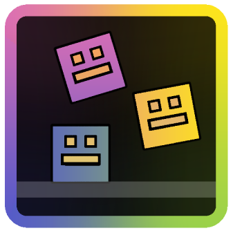

# Attempt Playback Mod

Records every attempt in each level, and lets you replay them in real-time

Mod menu button is on the left of the pause screen

Visit the mod settings to disable the mod and change some stuff (like Player Object pooling)

Warning: Understand that recording a large number of attempts may lead to a large attempt save file (which may slow down loading a level if large enough)

# IMPORTANT

Completing a level with the playback bot prevents completion, but can still count as a full run to some mods like Death Tracker

Turn off Click Between Frames (during playback) to fix click state issues (needed to make click toggles work)

Please do not switch start position while recording in practice mode as that will break the recording

Frame Stepper currently breaks recordings

# Limitations

This mod is still early in developement so expect some bugs. Please report any bugs on [discord](https://discord.gg/9MmXKBwvnA) in the bug reports channel

I have not tested platformer mode much so expect plenty of bugs. This mod is currently intended for calssic levels